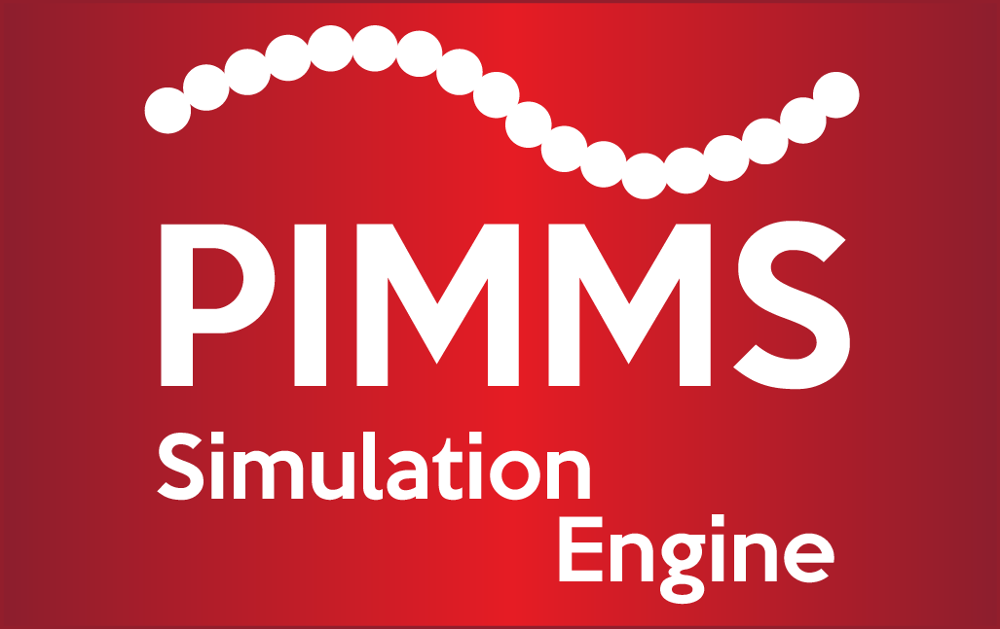

<p align="center">
  
</p>

<h1 align="center">PIMMS: Polymer Interactions in Multi-component MixtureS</h1>

<!-- Badges -->
<p align="center">
  <a href="https://idptools-pimms.readthedocs.io/en/latest/?badge=latest"></a>
  <a href="https://www.gnu.org/licenses/lgpl-3.0"></a>
  <a href="https://www.python.org/downloads/"></a>
  <a href="https://github.com/holehouse-lab/PIMMS/commits/master"></a>
  <a href="https://github.com/holehouse-lab/PIMMS/issues"></a>
  <a href="https://github.com/holehouse-lab/PIMMS/pulls"></a>
  <a href="https://github.com/holehouse-lab/PIMMS/stargazers"></a>
</p>

---

**PIMMS** is a lattice-based, coarse-grained Monte Carlo simulation engine for exploring the phase behaviour and conformational properties of polymer systems — single homo- or hetero-polymers, many-chain mixtures, and biomolecular condensates — in both 2D and 3D.

📖 **Full documentation:** https://idptools-pimms.readthedocs.io

## What is PIMMS?

PIMMS discretises space into a square (2D) or cubic (3D) lattice. A polymer is a chain of **beads** on that lattice, with consecutive beads occupying lattice-adjacent sites (in the Chebyshev sense, so chains can fold compactly), and every site holds at most one bead (hard-sphere exclusion). You define a system in a plain-text **keyfile** and the interactions in a **parameter file**, then run it with a single command-line executable:

```bash
PIMMS -k KEYFILE.kf
```

The engine samples configurations with **Metropolis Monte Carlo**. Interactions act over three nested length scales (short / long / super-long range) plus solvation and backbone-angle terms, all set in the parameter file, so you can build anything from a single self-avoiding chain to a multi-component condensate. A rich move set — local **crankshaft** moves, whole-chain **reptation (slither)** and cooperative **pull** megamoves, rigid-body **cluster** moves, **virtual-move Monte Carlo (VMMC)**, and **temperature-switch (TSMMC)** excursions — samples efficiently and escapes kinetic traps, under either periodic or hard-wall boundaries.

The hot loops are written in optimised **Cython** that compiles to native C, with an optional multi-threaded **OpenMP** kernel for large systems. Trajectories are written as standard `.pdb` + `.xtc` (via `mdtraj`), and the bundled **`lemonade`** package provides fast, hierarchical post-hoc analysis (conformational properties, cluster/condensate physics, coexistence densities and interfacial tension). See the [documentation](https://idptools-pimms.readthedocs.io) for the full model, keyword reference, and worked examples.

## Who develops PIMMS?

Alex Holehouse developed an initial version of PIMMS during his time in the [Pappu lab](http://pappulab.wustl.edu/), where it was used in a number of publications (most notably in Martin/Holehouse/Peran et al. Science 2020, which used an old Python 2.7 implementation [available on Zenodo](https://zenodo.org/records/3588456)). Since starting [his own lab](http://holehouse.wustl.edu/), the majority of PIMMS has been rewritten, and Dr. Ryan Emenecker has joined as a core developer. PIMMS is developed and maintained exclusively by the [Holehouse lab](http://holehouse.wustl.edu/) at Washington University in St. Louis, with contributions from many lab members of the years. 

## Installation

PIMMS is available on PyPI. Because the performance-critical parts are written in Cython, installing PIMMS compiles native C extensions on your machine, so you need a working **C compiler** (clang on macOS, gcc on Linux) and **Python ≥ 3.8** (3.10+ recommended; our development/test environment is 3.12).

These steps mirror the [installation guide](https://idptools-pimms.readthedocs.io/en/latest/installation.html) in the documentation.

**1. Create a clean environment** (with `conda` or `uv`):

```bash
# with conda
conda create -n pimms python=3.12 -y
conda activate pimms

# ...or with uv
uv venv --python 3.12
source .venv/bin/activate
```

**2. Install the dependencies** (with `uv`, prefix each with `uv pip` instead of `pip`):

```bash
pip install numpy scipy cython versioningit
pip install mdtraj
```

**3. Install PIMMS** from PyPI:

```
pip install idptools-pimms
```

**4. Install PIMMS** directly from GitHub:

```bash
pip install --no-build-isolation git+https://github.com/holehouse-lab/PIMMS.git
```

...or from a source checkout (recommended if you intend to develop PIMMS):

```bash
git clone https://github.com/holehouse-lab/PIMMS.git
cd PIMMS
pip install -e . --upgrade --force-reinstall     # ...or: uv pip install -e . --no-deps --reinstall
```

Verify the install with `PIMMS --version` and `PIMMS --info` (which lists every keyfile keyword).

## Referencing PIMMS

A dedicated PIMMS methods paper is in preparation; this section will be updated with its citation once it is available. In the meantime, if PIMMS is useful in your work, please cite the repository:

> Holehouse, A. S. & Emenecker, R. J. *PIMMS: Polymer Interactions in Multi-component MixtureS*. Holehouse Lab, Washington University in St. Louis. https://github.com/holehouse-lab/PIMMS

## License

PIMMS is released under the **GNU Lesser General Public License v3.0 (LGPLv3)**. See [`LICENSE`](LICENSE) for details.
